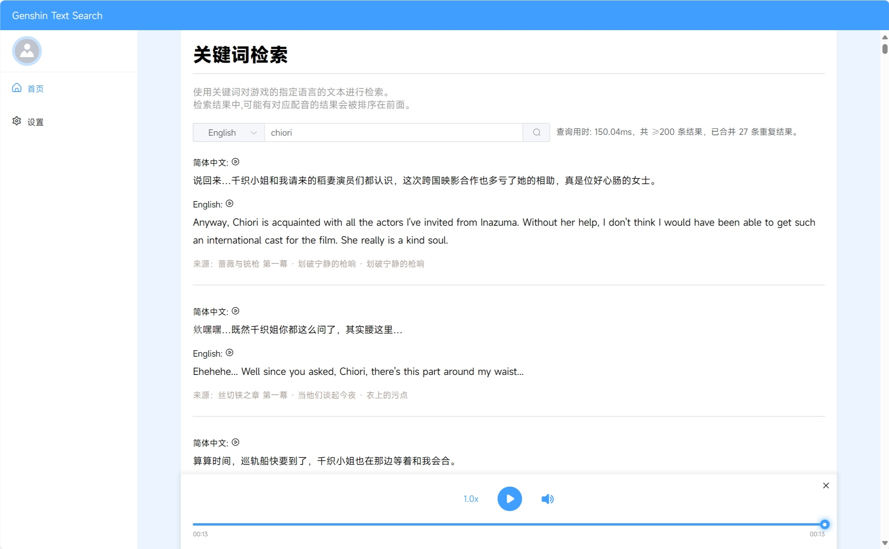

# Genshin Text Search

## Demo



## 简介
原神文本搜索工具，可按关键字搜索所有文本内容，并可以选择任意语言，播放对应的语音，可用于**外语学习**，剧情考据，模型训练等用途

设置搜索语言，并输入关键词搜索后，系统会展示多语言结果，如果该语言有对应的发音，则可以点击按钮播放。同时，下方会显示文本的来源

本工具可以设置搜索使用的语言、结果显示语言。

> 原神游戏内置了15种语言与4种配音。截止到4.5版本，原神的英文文本已经有大约460万条文本与12万条语音数据，其中涵盖了不同难度的词汇，可以作为语言学习的参考，加深记忆
>
> （做这个工具的初衷是由于某翻译平台机器发音的例句过多


## 使用方法

1. 在`release`板块下载打包好的程序与预导入的数据库的压缩文件，将其解压，然后将`data.db`暂时放入`dbBuild`文件夹
2. 安装环境：
    ```shell
    pip install -r requirements.txt
    ```
3. 按照[这篇教程](./server/dbBuild/readme.md)导入语言文件
4. 创建`config.json`文件，设置初始的游戏资源路径，显示语言，默认搜索语言，来源显示语言，格式看起来像这样：

    语言代码请参考上述教程中的代码（1：简体中文，4：英语）
    ```json
        {
            "resultLanguages": [1, 4],  // 显示语言
            "defaultSearchLanguage": 4,  // 默认搜索使用的语言
            // 游戏资源路径，一般是YuanShen_Data或者GenshinImpact_Data
            "assetDir": "D:\\ys\\Genshin Impact Game\\YuanShen_Data",  
            "sourceLanguage": 1  // 来源显示的语言
        }
    ```
5. 在游戏中下载好想听的语音包
6. 运行`server.py`即可启动服务端，打开`http://127.0.0.1:5000`即可使用
    ```shell
    python server.py
    ```

## 存在的问题

1. 目前仅做了剧情对话文本、角色语言的溯源，其余一律显示为“其他文本”，如果您愿意提供其他文本的溯源方法，欢迎提出pr
2. 语音来源也有许多，目前仅完成了剧情对话、角色详情的语音与文本的对照
3. 不同语言之间的文本意义并非完全相同，使用时还请仔细甄别

## 其他

1. 原神，及其语音和文本版权不属于我，本仓库也不提供语音或文本的下载，提供的数据库仅对文本条目进行了索引，不含具体的文本。
2. 语音直接读取自游戏数据包，并且不会对其进行任何修改
3. pck读取脚本来自于[BUnipendix/WwiseFilePackager](https://github.com/BUnipendix/WwiseFilePackager)
4. wem格式转换使用了[vgmstream](https://github.com/vgmstream/vgmstream)的wasm版本